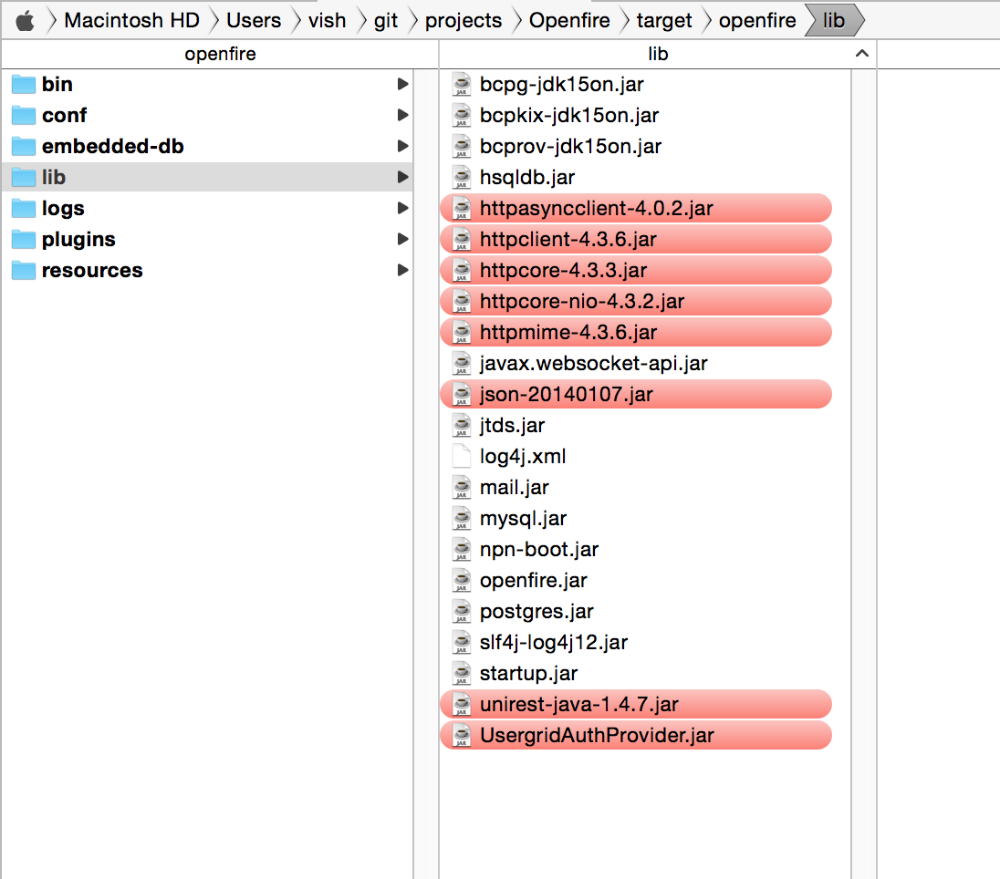
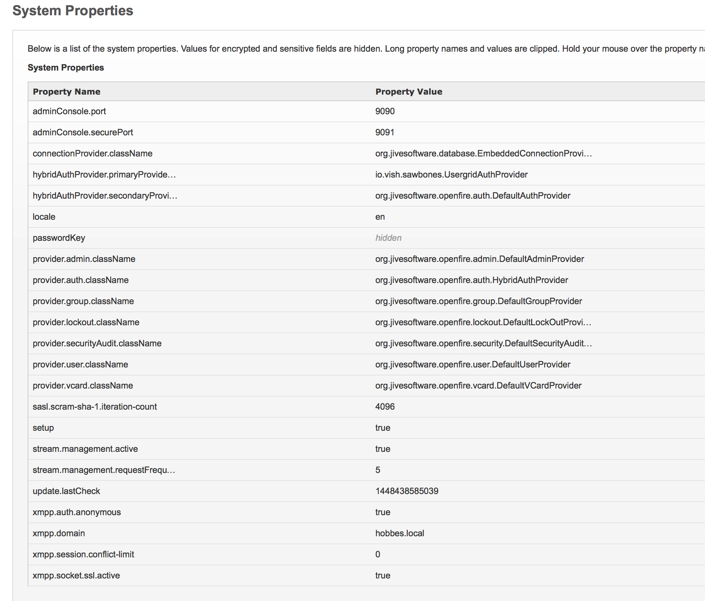

# UsergridAuthProvider

This is a custom authentication provider for Openfire that talks to a Usergrid API to get authentication information.

In order to add this to Openfire, build the artifact JAR and drop into the Openfire lib directory, along with the other dependency jars as illustrated in this screenshot - the files marked in red should be added.

Openfire will need to be configured to use the auth provider as follows. Open the System properties page in the admin console and set up the auth properties as in the image:

